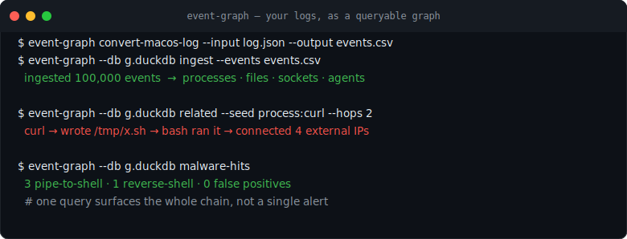

# Event Graph

[](https://github.com/yingchen-coding/event-graph/actions)
[](pyproject.toml)
[](LICENSE)



Find the few events that matter inside millions of connected records without standing up a graph
database.

Event Graph builds a compact entity/event index for large logs: ingest records, connect them by
users, hosts, files, sessions, tickets, transactions, or any other entity, then jump to related
events without scanning the raw dataset again.

It is not a graph visualization tool. It is an indexing pattern:

1. Ingest events.
2. Extract entities and relationships.
3. Build compact `entity_edges(src, dst, rel)` and `entity_events(entity, event_id)` tables.
4. Query from one entity to all related events without scanning the whole raw dataset.

This can be used for security logs, agent traces, audit logs, product events, support tickets,
financial transactions, workflow histories, or anything else where records are connected by
entities.

## Star This If

- You need to chase one user, IP, session, ticket, file, or transaction through huge logs.
- You want graph-style investigation over Parquet, CSV, or JSON before deploying a graph database.
- You care about ingestion speed, explainable tables, and benchmark artifacts you can share.

## Why This Works

The scalable pattern is:

- keep high-volume raw events in columnar/relational storage;
- materialize compact `entity_edges(src, dst, rel)`;
- materialize compact `entity_events(entity, event_id)` as an inverted index;
- query by expanding related entities first, then join only matching `event_id`s back to raw events;
- store analyst/user edges and notes as overlays instead of rewriting raw data;
- delete edges/notes with tombstones so investigations stay auditable.

DuckDB is used here as the local scan/index engine. KuzuDB and Memgraph are useful next steps when
you want a dedicated graph runtime; this repo can export Kuzu-style CSV and Memgraph-style Cypher.

## Generic Input

Generic event CSV/JSON/Parquet should contain:

`ts, src, dst, rel`

Optional columns are preserved and returned with matching events.

Example:

```csv
ts,src,dst,rel,details
2026-01-01T00:00:00Z,user:alice,service:billing,used,opened billing page
2026-01-01T00:00:01Z,service:billing,file:invoice.pdf,touched,generated export
```

## Install

```bash
python -m pip install -e '.[dev]'
```

## Quick Start

```bash
event-graph generate-synthetic /tmp/events.csv --rows 100000
event-graph --db /tmp/events.duckdb ingest --events /tmp/events.csv
event-graph --db /tmp/events.duckdb related-events user:alice --hops 2 --limit 20
event-graph --db /tmp/events.duckdb explain user:alice --hops 2 --output /tmp/alice-subgraph.json
```

`related-events` truncates long `details` fields in CLI output by default so large traces do not
flood the terminal. Use `--details-max-chars 0` when you need full payloads.

Use `explain` when you need a shareable investigation artifact. It returns the seed, traversed
nodes, effective edges, and related event rows in one JSON document.

## Arbitrary Schemas

For logs that do not already have `ts,src,dst,rel`, provide a JSON mapping:

```json
{
  "timestamp": "{time}",
  "details": "{message}",
  "edges": [
    {"src": "user:{actor}", "rel": "{verb}", "dst": "ticket:{target}"}
  ]
}
```

Then ingest without rewriting the source file:

```bash
event-graph --db /tmp/activity.duckdb ingest-config \
  --source /tmp/activity.csv \
  --config examples/activity_mapping.json
```

Built-in adapters are available for common operational records:

```bash
event-graph --db /tmp/product.duckdb ingest-adapter product --source examples/product_events.csv
event-graph --db /tmp/audit.duckdb ingest-adapter audit --source examples/audit_log.csv
event-graph --db /tmp/tickets.duckdb ingest-adapter ticket --source examples/tickets.csv
```

JSONL agent traces can be converted first, then ingested as generic event edges:

```bash
event-graph convert-agent-trace --input /path/to/session.jsonl \
  --output /tmp/agent-trace.csv
event-graph --db /tmp/agent-trace.duckdb ingest --events /tmp/agent-trace.csv
event-graph --db /tmp/agent-trace.duckdb related-events session:SESSION_ID --hops 1
```

The conversion output includes a `sessions` field. Use one of those values as
`session:SESSION_ID`.

Append new events without replacing the database:

```bash
event-graph generate-synthetic /tmp/events-new.csv --rows 10000
event-graph --db /tmp/events.duckdb append-events --events /tmp/events-new.csv
```

Partitioned Parquet can be filtered before indexing:

```bash
event-graph --db /tmp/events.duckdb ingest-parquet \
  --source '/data/events/day=*/part-*.parquet' \
  --where "day = DATE '2026-01-01'"
```

`--where` is intended for local trusted filters. The CLI rejects multi-statement or mutating SQL
tokens, but it is not a sandbox for untrusted input.

## Local Computer Events

Filesystem metadata can be converted into event edges:

```bash
event-graph collect-files ~/Documents/repo /tmp/local-files.csv --max-files 10000
event-graph --db /tmp/local.duckdb ingest --events /tmp/local-files.csv
event-graph --db /tmp/local.duckdb related-events "ext:.py" --hops 2 --limit 20
```

macOS unified logs can be sampled with the system `log` command, converted, and queried:

```bash
/usr/bin/log show --last 2m --style json --info > /tmp/macos-log.json
event-graph convert-macos-log --input /tmp/macos-log.json --output /tmp/macos-log.csv
event-graph --db /tmp/macos.duckdb ingest --events /tmp/macos-log.csv
event-graph --db /tmp/macos.duckdb search backupd
```

Observed local validation on a Mac mini:

```json
{
  "filesystem_events": 5485,
  "macos_log_events": 5000,
  "generic_1m_ingest_seconds": 1.434,
  "generic_1m_query_millis": 205.178,
  "generic_1m_returned_events": 100
}
```

Add context without mutating raw events:

```bash
event-graph --db /tmp/events.duckdb add-edge user:alice owns ticket:INC-123 \
  --note "Manual analyst link"

event-graph --db /tmp/events.duckdb add-note user:alice "Repeated export failures"
event-graph --db /tmp/events.duckdb search export
```

Benchmark:

```bash
event-graph --db /tmp/events.duckdb benchmark --rows 1000000 \
  --seed user:alice --hops 2 --limit 100 \
  --output /tmp/event-graph-benchmark.json
```

10M-row local benchmark on this machine:

```json
{
  "rows": 10000000,
  "generated_seconds": 9.579,
  "ingest_seconds": 8.635,
  "query_millis": 2793.819,
  "returned_events": 100,
  "entity_edges": 4,
  "entity_events": 20000000
}
```

## Security Adapter Example

Security logs are one adapter, not the whole product.

Expected security columns:

`ts, src_ip, dst_ip, src_user, url_domain, threat_name, threat_category, action, application, bytes`

```bash
event-graph --db demo.duckdb load-sample
event-graph --db demo.duckdb malware-hits
event-graph --db demo.duckdb related-events domain:bad.example --hops 2
```

Generate a synthetic security dataset:

```bash
event-graph generate-synthetic-security /tmp/fw.csv --rows 1000000
event-graph --db /tmp/fw.duckdb ingest-security --logs /tmp/fw.csv
event-graph --db /tmp/fw.duckdb related-events domain:bad.example --hops 2 --limit 20
```

Observed local security benchmark on this machine:

```json
{
  "rows": 1000000,
  "ingest_seconds": 5.145,
  "query_millis": 450.566,
  "returned_events": 100,
  "entity_edges": 1064556,
  "entity_events": 4500000
}
```

## Exports

```bash
event-graph --db /tmp/events.duckdb export kuzu-csv /tmp/kuzu
event-graph --db /tmp/events.duckdb export memgraph-cypher /tmp/memgraph
```


## What To Build Next

- Iceberg catalog integration.
- Streaming ingest service around the append APIs.
- Larger real-world public datasets for reproducible launch benchmarks.
